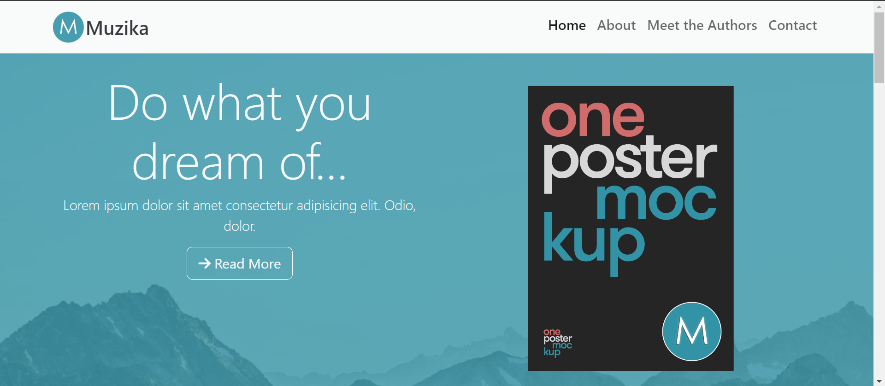
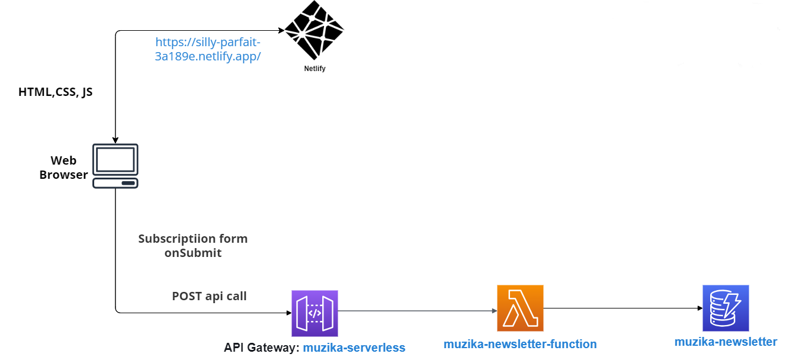

# Muzika Book Website



## Introduction

A website made using a template by Bootstrap. Built from scratch.

## Features

- **Responsive Design**: The website is designed to look great on both desktop and mobile devices.
- **Working backend**: Newsletter subscription working by deploying a separate lambda function as API.
- **Contact Form**: A simple way to get in touch with me directly from the website.

## Technologies Used

- HTML5
- CSS3
- JavaScript
- Bootstrap
- AWS Cloud (Lambda, API Gateway, DynamoDB, IAM, CloudWatchLogs)

## Architecture Diagram




## Setup

To run this project locally, clone the repository and open `index.html` in your browser.

```bash
git clone https://github.com/jamilirshad/Muzika
cd portfolio-website
open index.html

```

The python code for the Lambda Function which is triggered by the API call in index.js

```python
import json
import boto3
import uuid

# Initialize the DynamoDB client
dynamodb = boto3.resource('dynamodb')

def lambda_handler(event, context):
    try:
        # Parse name and email from the event
        name = event['name']
        email = event['email']

        # Generate a UUID
        unsubscription_id = str(uuid.uuid4())

        # Get the table
        table = dynamodb.Table('muzika-newsletter')

        # Put the new subscription into the DynamoDB table
        response = table.put_item(
            Item={
                'unsubscription_id': unsubscription_id,
                'name': name,
                'email': email
            }
        )

        # Return a success response
        return {
            'statusCode': 200,
            'body': json.dumps('Subscription added successfully!')
        }
    except Exception as e:
        # Return an error response
        return {
            'statusCode': 500,
            'body': json.dumps(f'Error adding subscription: {str(e)}')
        }
```


# Muzika book Website

[](https://app.netlify.com/sites/silly-parfait-3a189e/deploys)

Live Demo: https://silly-parfait-3a189e.netlify.app/

...

## Contact

If you'd like to contact me, please use the form on the website, or reach out on [LinkedIn](https://www.linkedin.com/in/jamilirshad32/).

Thank you for visiting!
```
