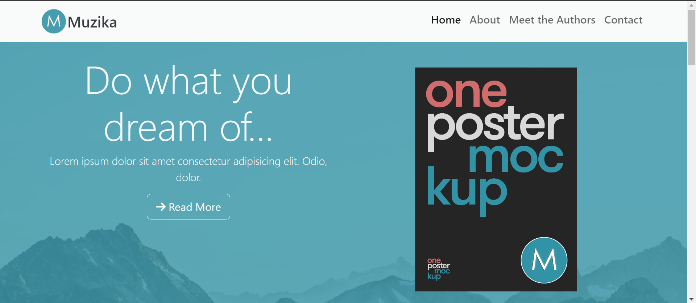

# Muzika Book Website



## Introduction

A website made using a template by Bootstrap. Built from scratch.

## Features

- **Responsive Design**: The website is designed to look great on both desktop and mobile devices.
- **Working backend**: Newsletter subscription working by deploying a separate lambda function as API.
- **Contact Form**: A simple way to get in touch with me directly from the website.

## Technologies Used

- HTML5
- CSS3
- JavaScript
- Bootstrap
- AWS Cloud

## Setup

To run this project locally, clone the repository and open `index.html` in your browser.

```bash
git clone https://github.com/yourusername/portfolio-website.git
cd portfolio-website
open index.html

```markdown

# Muzika book Website

[](https://your-netlify-url)

Live Demo: [https://your-netlify-url](https://your-netlify-url)

...

## Contact

If you'd like to contact me, please use the form on the website, or reach out on [LinkedIn](https://www.linkedin.com/in/jamilirshad32/).

Thank you for visiting!
```
